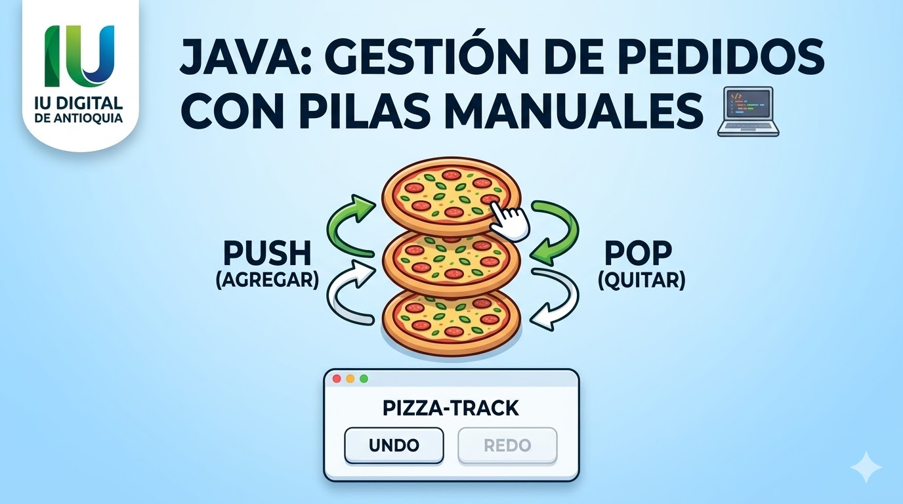

# Evidencia 2 - Pizza Track



Sistema de gestión de pedidos de pizza por consola, implementado en Java. Utiliza una **pila (stack) personalizada** con lista enlazada para soportar operaciones de Undo/Redo sobre los pedidos.

## Demo

[](https://youtu.be/XoE6r1dgEZ8)

## Funcionalidades

- **Registrar pedido** — ingresa nombre y 3 ingredientes de una pizza
- **Undo** — deshace el último pedido registrado
- **Redo** — rehace el último pedido deshecho
- **Mostrar actual** — muestra el pedido en producción (peek)

## Clases

| Clase | Responsabilidad |
|-------|----------------|
| `Pizza` | Almacena el nombre y los 3 ingredientes de una pizza |
| `Pila` | Stack genérico de `Pizza` implementado con nodos enlazados. Soporta `push`, `pop`, `peek` e `isEmpty` |
| `GestionPedidos` | Usa dos pilas (principal y secundaria) para implementar Undo/Redo |
| `Main` | Menú de consola con las opciones del sistema |

## Estructura del proyecto

```
Pizza/
├── src/
│   ├── Pizza.java          # Modelo de una pizza (nombre + ingredientes)
│   ├── Pila.java           # Estructura de datos pila con lista enlazada
│   ├── GestionPedidos.java # Lógica de negocio: registrar, undo, redo
│   └── Main.java           # Punto de entrada y menú interactivo
├── bin/                    # Archivos compilados (generados automáticamente)
├── lib/                    # Dependencias externas
└── .gitignore
```

## Requisitos

- Java 11 o superior
- Visual Studio Code con la extensión [Extension Pack for Java](https://marketplace.visualstudio.com/items?itemName=vscjava.vscode-java-pack)

## Cómo ejecutar

1. Abre el proyecto en VSCode
2. Presiona `F5` o ejecuta desde el botón **Run** en `Main.java`

O desde terminal:

```bash
javac -d bin src/*.java
java -cp bin Main
```
